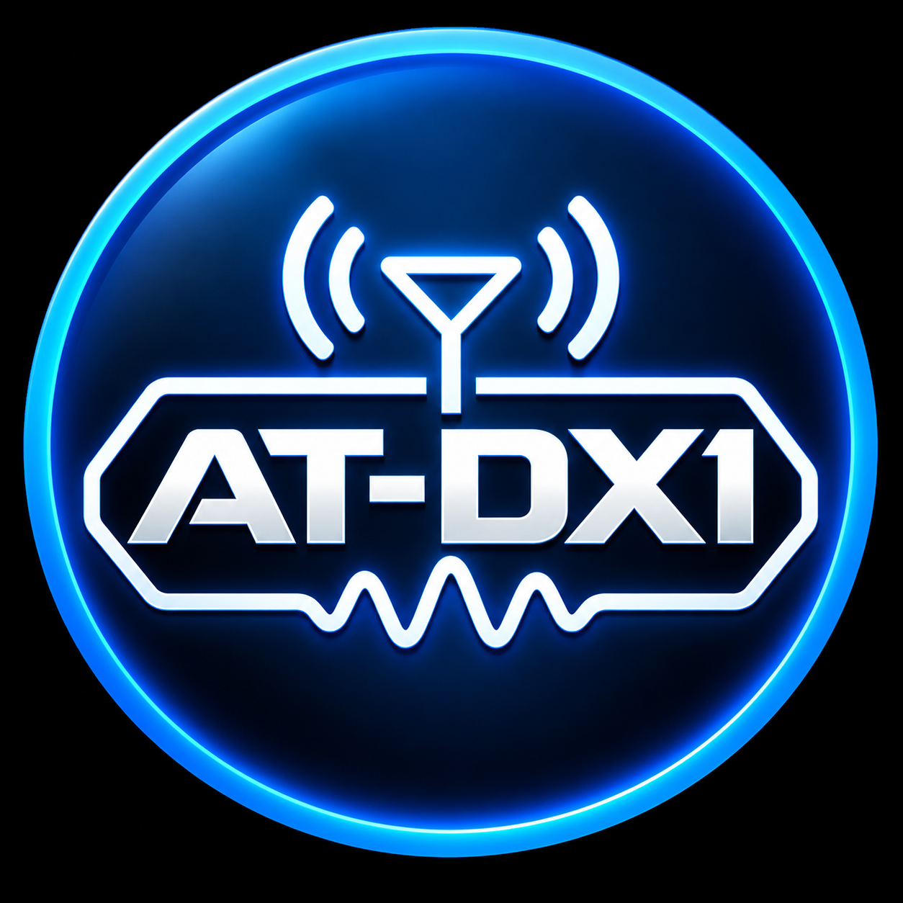
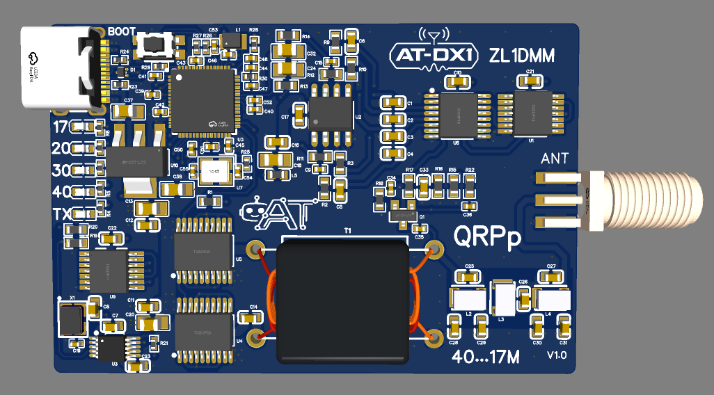
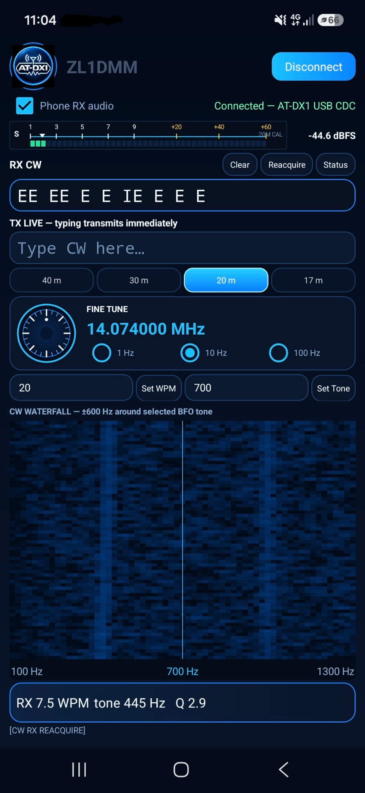
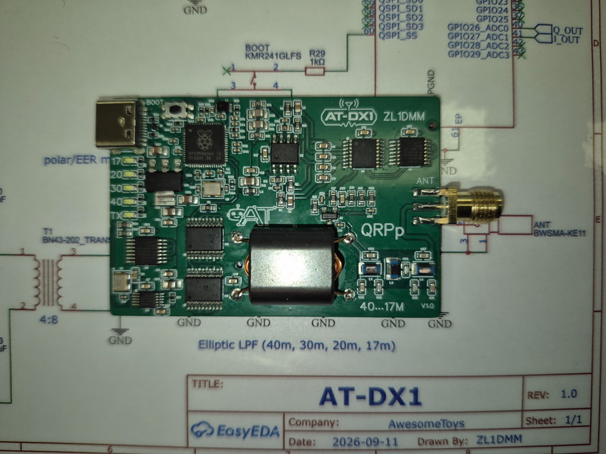

  

# AT-DX1

**A compact 40 m / 30 m / 20 m / 17 m HF QRPp transceiver for portable amateur-radio operation, especially POTA and SOTA.**

AT-DX1 is an experimental HF transceiver project by **ZL1DMM**. It combines an RP2354A microcontroller, Si5351A RF synthesis, a quadrature-sampling receiver, a compact 74ACT244-based transmitter, USB audio/CAT integration, and onboard CW processing on one small board.

This repository snapshot is centred on the **RP2354A V1.0 hardware dated 2026-09-14** and the current RP2350/RP2354A firmware snapshot dated **2026-09-12**.

  

## What AT-DX1 is designed to do

AT-DX1 is intended to be a small, USB-friendly field transceiver that can be used directly with established digital-mode software or with its dedicated Android CW companion interface.

### Major features

- **40 m, 30 m, 20 m and 17 m** HF coverage.
- **QRPp output**, aimed at lightweight portable operation rather than high-power operation.
- **FT8 / FT4 operation with existing applications** rather than requiring a proprietary digital-mode program.
- **USB Audio Class interface**: the radio presents receive/transmit audio to the host like a USB sound card.
- **USB CDC CAT control**, with a **Kenwood TS-480-style CAT command set** used by the current firmware for Hamlib/WSJT-X compatibility.
- Designed for use with software such as **WSJT-X** and compatible FT8/FT4 applications.
- **Onboard CW receive decoding** in the RP2354A firmware.
- **Onboard CW transmit encoding/keying**: text sent by the companion interface is converted to Morse by the radio itself.
- Automatic CW receive tone acquisition/tracking and automatic receive-speed estimation in the current firmware.
- **5 ms raised-cosine CW key shaping** to soften key edges.
- Companion **Android CW control/terminal interface** for frequency control, band selection, decoded text, live text-to-CW transmission, WPM/tone control and a CW waterfall display.
- USB-powered/control-oriented architecture suitable for phone, tablet or computer operation.
- Dedicated **40 / 30 / 20 / 17 m LEDs** and TX indication on the PCB.
- Onboard elliptic low-pass filtering for the supported HF range.
- SMA antenna connector.

The radio therefore has two main software personalities:

1. **FT8 / FT4 radio interface** — connect it to a PC/phone, select the AT-DX1 USB audio device, and control the radio by CAT from compatible software.
2. **CW terminal radio** — the RP2354A performs the actual CW receive DSP and Morse transmit timing, while the Android app acts as the display, tuning/control surface and text terminal.

## FT8 / FT4 host compatibility

The current firmware exposes a 48 kHz USB Audio Class 2 interface and USB CDC serial/CAT interface. The CAT implementation follows the Kenwood TS-480 style expected by Hamlib-based applications, including WSJT-X. Successful CAT SET commands are intentionally silent and common status/query commands are answered in the form expected by the host software.

For transmission, the firmware measures the incoming FT8 audio tone and shifts the RF output accordingly. It also includes an FT8 audio-frequency safety window, retune deadband and noisy-crossing rejection. CAT PTT by itself does not create an RF carrier: valid transmit audio is required by the normal FT8 transmit path.

See [docs/USB_CAT_AND_DIGITAL_MODES.md](docs/USB_CAT_AND_DIGITAL_MODES.md).

## Onboard CW

CW is not merely decoded in the Android phone. The current RP2354A firmware contains the CW receive DSP and transmit keyer.

The firmware scans for a plausible CW tone, tracks it, estimates Morse timing/WPM, decodes characters, and sends decoded text/status to the companion interface. For transmit, normal text entered in CW terminal mode is queued and converted to Morse timing by the radio. The TX control uses raised-cosine edge shaping.

The Android companion app is intended to provide:

- decoded RX CW text;
- live typed CW transmission;
- 40/30/20/17 m band selection;
- fine frequency tuning;
- TX WPM setting;
- receive/BFO tone setting;
- CW tone reacquisition/status controls;
- an approximately ±600 Hz CW waterfall around the selected BFO tone;
- phone RX-audio monitoring/control.

  

See [docs/CW_MODE.md](docs/CW_MODE.md).

## Hardware overview

The V1.0 design includes:

- **RP2354A** microcontroller (RP2350A family, QFN-60)
- **Si5351A** clock synthesizer
- **74LVC74** flip-flops for RF clock division/phasing
- **SN74CBTLV3253** quadrature-sampling detector switching
- **MCP6022** baseband op-amp
- **2 × SN74ACT244** devices in the HF transmit driver/PA section
- **4:8 RF transformer** in the transmitter output stage
- onboard **elliptic low-pass filter** covering the 40 m to 17 m design range
- **USB-C** connection
- band LEDs for **40 / 30 / 20 / 17 m** plus TX indication
- SMA antenna connector

### RF clock plan used by the current firmware

**Receive:** Si5351 CLK0 is generated at 4× the dial frequency and divided by the 74LVC74 stage to produce final-frequency 0°/90° quadrature clocks for the QSD.

**Transmit:** Si5351 CLK1 is generated at 2× the wanted RF frequency and divided by the TX flip-flop stage to produce complementary 180° drive for the transmitter.

The current firmware uses Q_OUT on GPIO26/ADC0 for USB receive audio; I_OUT on GPIO27/ADC1 is reserved for future I/Q firmware work.

## Prototype

  

## Repository layout

| Path | Contents |
|---|---|
| `hardware/schematic/` | Current schematic export |
| `hardware/fabrication/` | Manufacturer-ready Gerber ZIP |
| `hardware/bom/` | Normalized BOM plus original EasyEDA export |
| `firmware/source/` | Current RP2350/RP2354A Arduino firmware snapshot |
| `firmware/README.md` | Firmware features, dependencies and build notes |
| `android-app/` | Companion-app documentation and source placeholder |
| `docs/` | Hardware/software notes and operating information |
| `docs/images/` | PCB render, prototype photo, logos and app screenshot |
| `ACKNOWLEDGEMENTS.md` | Credits, including WB2CBA / TinyDX |
| `LICENSE.md` | Mixed-licence map for hardware, software and branding |
| `LICENSES/` | Licence texts |
| `TRADEMARKS.md` | AT-DX1 name/logo/branding notice |

## Fabrication files

Current manufacturing package:

`hardware/fabrication/AT-DX1_Gerbers_RP2354A_v1.0_2026-09-14.zip`

Current normalized BOM:

`hardware/bom/AT-DX1_BOM_RP2354A_2026-09-14.csv`

The original EasyEDA BOM export is retained under `hardware/bom/source/`.

> **Important:** AT-DX1 is experimental amateur-radio hardware. Before connecting an antenna, verify supply rails, firmware configuration, RF output power, harmonic suppression and spectral cleanliness into a suitable 50-ohm dummy load. The operator is responsible for complying with the amateur-radio rules that apply in their country.

## Acknowledgement — WB2CBA / TinyDX

A major acknowledgement goes to **Barbaros Aşuroğlu, WB2CBA**, creator of **TinyDX**.

TinyDX was an important inspiration for AT-DX1: in particular, its focus on a very small USB-oriented HF QRPp transceiver and WB2CBA's practical use of the **74ACT244 logic-buffer IC as an HF RF PA/driver stage** strongly influenced the direction of this project.

Original TinyDX repository:

https://github.com/WB2CBA/TinyDX---Tiny-Digital-Modes-HF-Transceiver

TinyDX article:

https://antrak.org.tr/blog/tinydx-my-quest-for-designing-the-smallest-digital-modes-hf-transceiver/

AT-DX1 is not affiliated with or endorsed by WB2CBA. See [ACKNOWLEDGEMENTS.md](ACKNOWLEDGEMENTS.md) for the full acknowledgement and third-party notice.

## Project status

**Prototype / active development.** The hardware files represent the 2026-09-14 RP2354A V1.0 snapshot. The current firmware source is included. The Android companion-app source itself was not present in the supplied project files used for this repository snapshot, so `android-app/` currently documents the app/interface and reserves the location where its source can be added.

## Licensing

AT-DX1 uses a mixed licence appropriate to hardware + software projects:

- **AT-DX1 original hardware design files:** CERN Open Hardware Licence Version 2 - Permissive (**CERN-OHL-P-2.0**).
- **AT-DX1 original firmware and Android companion-app software:** **MIT License**.
- **AT-DX1 logos, project branding, photographs and promotional artwork:** not included in the hardware/software open-source licence grant; see [TRADEMARKS.md](TRADEMARKS.md).
- Third-party components or code, if any, remain subject to their own licence/copyright terms.

See [LICENSE.md](LICENSE.md) and the full texts under [`LICENSES/`](LICENSES/).

---

**AT-DX1 — ZL1DMM**  
*HF QRPp · 40 m / 30 m / 20 m / 17 m · FT8 / FT4 / CW · POTA / SOTA*
