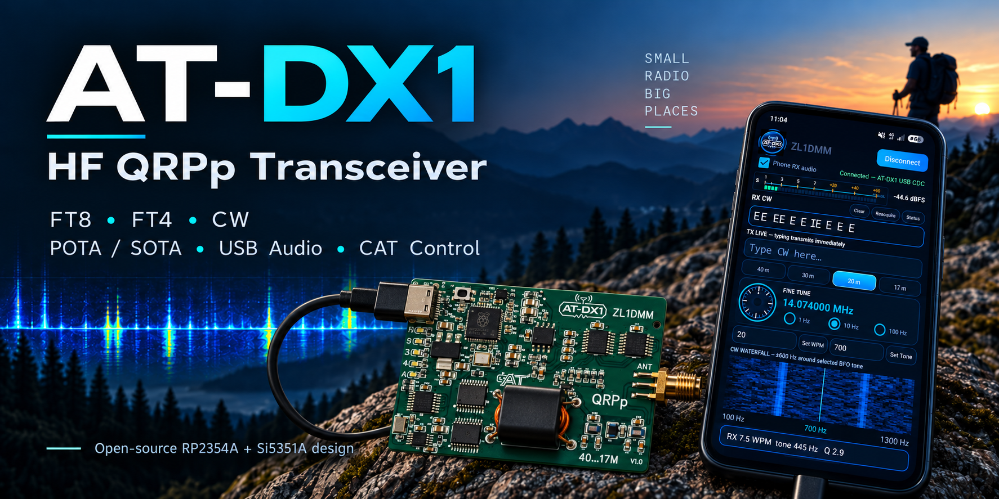
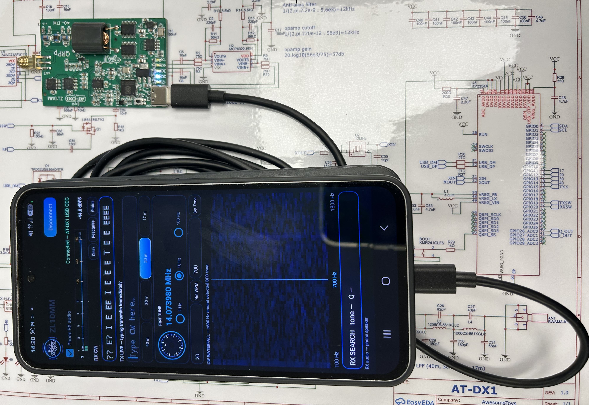

  

# AT-DX1

**A compact 40 m / 30 m / 20 m / 17 m HF QRPp transceiver for FT8, FT4 and CW portable operation.**

AT-DX1 is an experimental open-source HF transceiver project by **ZL1DMM**. It combines an RP2354A microcontroller, Si5351A RF synthesis, a true-I/Q quadrature-sampling receiver, a compact 74ACT244-based transmitter, USB audio/CAT integration, and a dedicated Android CW companion app.

Designed by ZL1DMM. Inspired in part by WB2CBA's TinyDX and its use of the 74ACT244 as an HF PA driver.

This repository tracks the **RP2354A V1.0 hardware dated 2026-09-14** and the current firmware/app update dated **2026-09-16**.

  

## Current capabilities

- **40 m, 30 m, 20 m and 17 m** HF coverage.
- **QRPp output** for lightweight portable operation including POTA/SOTA.
- **FT8 / FT4** with existing host applications such as WSJT-X.
- **48 kHz / 16-bit USB Audio Class 2** bidirectional sound-card interface.
- **USB CDC CAT**, emulating the useful Kenwood TS-480 command subset expected by Hamlib/WSJT-X.
- **True-I/Q receive**: Q_OUT on GPIO26/ADC0 and I_OUT on GPIO27/ADC1 are sampled continuously at 48 ksps per channel.
- RP2354A **USB/LSB sideband selection** using a 511-tap Hilbert/phasing receiver.
- Automatic **I/Q gain, quadrature and polarity calibration**, stored persistently in RP2350 flash-backed EEPROM emulation.
- **Click-free same-band tuning**: 1 Hz, 10 Hz and 100 Hz tuning updates PLLA without muting RX audio or resetting the PLL.
- **CW transmit encoder/keyer** in the radio with 5 ms raised-cosine key shaping.
- **Android CW receive DSP/decoder** with noise blanker, AGC, centred waterfall, S-meter, 300 Hz CW filter and adjustable 300-800 Hz listening BFO.
- Dedicated **40 / 30 / 20 / 17 m LEDs** and TX indication.
- SMA antenna connector and onboard HF low-pass filtering.

## Software personalities

### FT8 / FT4

Connect AT-DX1 to a PC or phone as a USB sound card and CAT-controlled radio. The radio accepts TS-480-style frequency/mode/PTT/status commands and uses the incoming USB transmit audio to generate the FT8/FT4 RF tone.

See [USB, CAT and digital modes](docs/USB_CAT_AND_DIGITAL_MODES.md).

### CW

CW uses a split radio/phone architecture:

- the **AT-DX1** owns RF tuning, band limits, USB-sideband conversion and Morse TX timing;
- the **Android app** owns CW noise blanking, narrow filtering, AGC, S-meter, waterfall, listening pitch and Morse decoding.

The app sends the **actual wanted RF / CW carrier frequency**. AT-DX1 keeps that value as the TX carrier and internally receives with:

`RX LO = wanted RF - 10,005 Hz`

The wanted CW signal therefore appears at **10.005 kHz audio**, exactly in the centre of the app's 10 Hz to 20 kHz waterfall. The app's BFO slider changes only the phone listening pitch and never retunes the radio.

See [CW mode and Android app](docs/CW_MODE.md).

## I/Q calibration

The receiver includes a built-in automatic I/Q calibration. The normal bench setup is:

- signal generator: **14.075000 MHz**;
- level: approximately **-60 dBm**;
- unmodulated carrier into the antenna input;
- radio/software idle in normal CAT mode.

Send `IQCAL;`. The firmware temporarily uses 14.074000 MHz USB, measures both ADC channels for one second, learns I/Q polarity, gain mismatch and residual quadrature error, saves the correction, and restores the previous receive setup.

Example successful status:

`IQCAL OK POL=- QG=0.98892 QM=+0.01250 IR=42.6 R=137.8;`

Full procedure and interpretation: [I/Q calibration guide](docs/IQ_CALIBRATION.md).

## Quick operating guide

A practical first-use sequence is:

1. Flash `firmware/source/AT-DX1.ino` to the RP2354A.
2. Run the I/Q calibration once with the 14.075 MHz / ~-60 dBm test carrier.
3. For FT8/FT4, select the AT-DX1 USB audio input/output and TS-480-style CAT port in the host application.
4. For CW, build/install the Android app from `android-app/source/`, connect the radio, select a band/frequency and listen/decode the signal fixed at the centre of the waterfall.
5. Verify RF output and harmonic suppression into a 50-ohm dummy load before connecting an antenna.

See [Operating guide](docs/OPERATING_GUIDE.md) and [Command reference](docs/COMMAND_REFERENCE.md).

## Hardware overview

The V1.0 design includes:

- **RP2354A** microcontroller (RP2350A family, QFN-60)
- **Si5351A** clock synthesizer
- **74LVC74** flip-flops for RF clock division/phasing
- **SN74CBTLV3253** quadrature-sampling detector switching
- **MCP6022** baseband op-amp
- **2 x SN74ACT244** devices in the HF transmit driver/PA section
- **4:8 RF transformer** in the transmitter output stage
- onboard HF low-pass filtering
- **USB-C** connection
- band LEDs for **40 / 30 / 20 / 17 m** plus TX indication
- SMA antenna connector

### RF clock plan

**Receive:** Si5351 CLK0 is generated at 4x the physical RX LO and divided by the 74LVC74 stage to produce final-frequency 0°/90° quadrature clocks for the QSD.

**Transmit:** Si5351 CLK1 is generated at 2x the wanted RF frequency and divided by the TX flip-flop stage to produce complementary 180° drive for the transmitter.

For normal same-band tuning, the fixed integer MS0 divider is retained and only PLLA is updated, without a PLL soft reset. Full clock rebuild/blanking is reserved for an actual band/profile change.

## Prototype

  
  

## Repository layout

| Path | Contents |
|---|---|
| `hardware/schematic/` | Current schematic export |
| `hardware/fabrication/` | Manufacturer-ready Gerber ZIP |
| `hardware/bom/` | Normalized BOM plus original EasyEDA export |
| `firmware/source/AT-DX1.ino` | Current RP2350/RP2354A firmware |
| `firmware/README.md` | Firmware features and build notes |
| `android-app/source/` | Current Android Studio source project (v1.23) |
| `android-app/README.md` | Android app architecture/build notes |
| `docs/IQ_CALIBRATION.md` | I/Q calibration procedure |
| `docs/OPERATING_GUIDE.md` | FT8/FT4 and CW operating guide |
| `docs/COMMAND_REFERENCE.md` | Basic CAT/CW/test command reference |
| `docs/` | Additional hardware/software notes |
| `ACKNOWLEDGEMENTS.md` | Credits, including WB2CBA / TinyDX |
| `LICENSE.md` | Mixed-licence map for hardware, software and branding |

## Fabrication files

Current manufacturing package:

`hardware/fabrication/AT-DX1_Gerbers_RP2354A_v1.0_2026-09-14.zip`

Current normalized BOM:

`hardware/bom/AT-DX1_BOM_RP2354A_2026-09-14.csv`

> **Important:** AT-DX1 is experimental amateur-radio hardware. Before connecting an antenna, verify supply rails, firmware configuration, RF output power, harmonic suppression and spectral cleanliness into a suitable 50-ohm dummy load. The operator is responsible for complying with the amateur-radio rules that apply in their country.

## Acknowledgement — WB2CBA / TinyDX

A major acknowledgement goes to **Barbaros Aşuroğlu, WB2CBA**, creator of **TinyDX**.

TinyDX was an important inspiration for AT-DX1, particularly its compact USB-oriented HF QRPp approach and practical use of the **74ACT244 logic-buffer IC as an HF RF PA/driver stage**.

Original TinyDX repository:

https://github.com/WB2CBA/TinyDX---Tiny-Digital-Modes-HF-Transceiver

TinyDX article:

https://antrak.org.tr/blog/tinydx-my-quest-for-designing-the-smallest-digital-modes-hf-transceiver/

AT-DX1 is not affiliated with or endorsed by WB2CBA. See [ACKNOWLEDGEMENTS.md](ACKNOWLEDGEMENTS.md).

## Project status

**Prototype / active development.** Hardware files represent the 2026-09-14 RP2354A V1.0 snapshot. Current firmware and Android v1.23 source are included and will continue to evolve as on-air and bench testing progresses.

## Licensing

- **AT-DX1 original hardware design files:** CERN Open Hardware Licence Version 2 - Permissive (**CERN-OHL-P-2.0**).
- **AT-DX1 original firmware and Android companion-app software:** **MIT License**.
- **AT-DX1 logos, project branding, photographs and promotional artwork:** see [TRADEMARKS.md](TRADEMARKS.md).
- Third-party components or code remain subject to their own terms.

See [LICENSE.md](LICENSE.md), [THIRD_PARTY.md](THIRD_PARTY.md) and [`LICENSES/`](LICENSES/).

---

**AT-DX1 — ZL1DMM**  
*HF QRPp · 40 m / 30 m / 20 m / 17 m · FT8 / FT4 / CW · POTA / SOTA*
